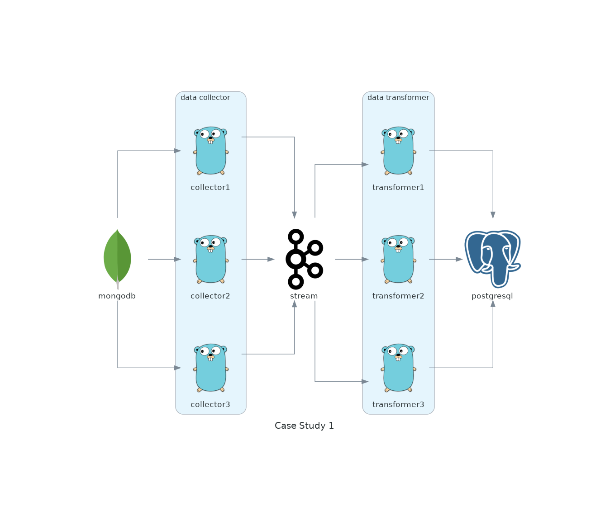

# DataOps Architecture Diagrams

Diagrams are generated using [Mingrammer's Diagrams](https://diagrams.mingrammer.com/).

## Case study 1: synchronize data from MongoDB to PostgreSQL

Requirements:
* Latency: no more than 5 minutes

